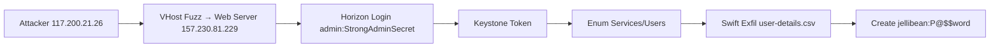

This writeup covers the **Hack The Box Sherlock challenge – Vantage**, investigating a private OpenStack cloud data breach.

Provided: `controller.2025-07-01.pcap`, `web-server.2025-07-01.pcap`.

**Key Questions:**
- Access method
- Data accessed
- Exfil confirmation
- Persistence

## Challenge Files

| File                       | Description                  |
| -------------------------- | ---------------------------- |
| controller.2025-07-01.pcap | OpenStack controller traffic |
| web-server.2025-07-01.pcap | Public web server traffic    |

```bash
file *
# pcap capture file, microsecond ts (little-endian)
```

## Attacker Identification

```bash
tshark -r web-server.2025-07-01.pcap -q -z conv,ip
```

**Attacker IP**: `117.200.21.26` → Target `157.230.81.229`.

**Technique**: VHost fuzzing (`dev.vantage.tech`, `backup.vantage.tech`, `api.vantage.tech`).

## Dashboard Login

```bash
tshark -r web-server.2025-07-01.pcap -Y "http.request.uri contains login"
```

| Attempt | Result      |
| ------- | ----------- |
| 1       | Failed      |
| 2       | Failed      |
| 3       | Failed      |
| 4       | **Success** |

**Failed attempts**: **3**.

## Keystone Auth (Controller)

```
GET /identity (09:41:44 UTC)
POST /identity/v3/auth/tokens
```

Payload:
```json
{
 "auth": {
  "identity": {
   "methods": ["password"],
   "password": {
    "user": {
     "name": "admin",
     "password": "StrongAdminSecret",
     "domain": {"name": "Default"}
    }
   }
  }
 }
}
```

**Response**: `HTTP 201 Created` (token issued).

## Service Enumeration

```
GET /identity/v3/services
GET /identity/v3/endpoints
GET /identity/v3/users
```

## Swift Object Storage

**Endpoint**: `http://134.209.71.220:8080`

**Account**: `AUTH_9fb84977ff7c4a0baf0d5dbb57e235c7` (Project ID `9fb84977ff7c4a0baf0d5dbb57e235c7`)

**Containers** (`GET /v1/AUTH_... ?format=json`):
| Container     |
| ------------- |
| user-data     |
| employee-data |

**Total**: **2**.

**Exfil**:
```
GET /v1/AUTH_.../user-data/user-details.csv (09:45:23 UTC)
```

## OpenStack RC Download

```
GET /dashboard/project/api_access/openrc/ (09:40:29 UTC)
```

## Persistence

```
POST /identity/v3/users
```

Payload:
```json
{
 "user": {
  "name": "jellibean",
  "password": "P@$$word",
  "enabled": true,
  "default_project_id": "9fb84977ff7c4a0baf0d5dbb57e235c7"
 }
}
```

**Response**: `HTTP 201 Created`.

## MITRE ATT&CK

| Technique        | ID    |
| ---------------- | ----- |
| Account Creation | T1136 |

**Tactic**: Persistence (**TA0003**).

## Timeline

| UTC Time | Event                  |
| -------- | ---------------------- |
| 09:40:29 | RC file download       |
| 09:41:44 | First API              |
| 09:42    | Keystone auth          |
| 09:45:23 | user-details.csv exfil |
| 09:46    | Employee data          |
| 09:48    | Project enum           |
| 09:48+   | jellibean user         |

## Attack Flow



## Commands Reference

```bash
tshark -r web-server.2025-07-01.pcap -Y 'http.request.uri contains login'
tshark -r controller.2025-07-01.pcap -Y 'http contains "admin"'
strings *.pcap | grep -i swift
```

## Conclusion & Lessons

**Confirmed breach**: Data leaked, persistence established.

**Fixes**:
- MFA for admin
- WAF vs vhost enum
- API monitoring
- Least privilege

All original details preserved + organized tables/Mermaid/TOC.
